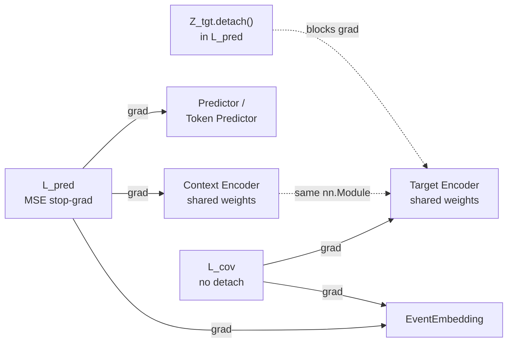

# EHR-JEPA Architecture Diagram

## Full System Data Flow

```mermaid
flowchart TD
    subgraph startup ["Startup  —  main.py"]
        YAML["ehr_config.yaml"] --> loadCfg["load_config()"]
        loadCfg --> seed["set_seed(42)"]
        seed --> vocab["_ensure_vocab()\nVocab.load() or build_vocab()\ncode → int index"]
        vocab --> norm["_ensure_normalizer()\nValueNormalizer.load() or .fit()\nper-code mean/std/winsorize"]
        norm --> wandb["init_wandb()\nlog config as YAML notes"]
        wandb --> buildModel["build_model()"]
        wandb --> buildLoaders["build_loaders()"]
    end

    subgraph dataLoad ["Data Loading  —  data/"]
        buildLoaders --> loadSplit["load_split(data_dir, split)\nreads all .parquet files\nOUT: pd.DataFrame"]
        loadSplit --> buildSeqs["build_subject_sequences(df)\ngroupby subject_id, sort by time\nNaT header rows first\nOUT: Dict[id → List[Event]]"]
        buildSeqs --> dataset["MEDSDataset\none sample per subject (pretrain)\nor per ACES row (prediction)"]
        dataset --> collator["MEDSCollator\nwindowing / padding per batch"]
    end

    subgraph perSample ["Per Sample  —  __getitem__"]
        dataset --> cutoff["[prediction] _apply_time_cutoff()\nremove events after prediction_time"]
        cutoff --> trunc["[prediction] _truncate_with_header()\nkeep header + most-recent events\nupdate AGE value"]
        trunc --> encode["_encode_events()\nvocab.encode(code) → int\n_compute_delta_times() → log(1+Δhours)\n_compute_z_scores() → (v-mean)/std"]
        encode --> itemDict["item dict\ncodes: List[int]\nvalues, z_scores, delta_times: List[float]"]
    end

    subgraph batchCollate ["Batch Collation  —  MEDSCollator"]
        collator --> winPad["_window_or_pad()\npretrain long: random window start\npretrain short: right-pad\nprediction: pad only"]
        winPad --> batchTensors["Batch tensors  all shape [B, L]\ncodes LongTensor\nattention_mask LongTensor\nvalues, z_scores, delta_times FloatTensor\nvalue_mask LongTensor"]
    end

    subgraph modelBuild ["Model Construction  —  build_model()"]
        buildModel --> emb["EventEmbedding\nnn.Embedding [vocab_size, d_model]\nor frozen ClinicalBERT + Linear(768→d)"]
        buildModel --> enc["EHRTransformerEncoder\nSHARED for target + context paths\n6 × RoPETransformerLayer"]
        buildModel --> prompt["TemporalSpanPrompt\nLinear(2→d) → GELU → Linear(d→d)"]
        buildModel --> predA["Predictor  (Branch A)\n2-layer shallow Transformer\noperates on 16 latent tokens"]
        buildModel --> predB["token_predictor  (Branch B)\n2-layer shallow Transformer\noperates on context+mask tokens"]
        buildModel --> ctxPool["context_pooler  (Branch A only)\nLatentCrossAttentionPool\n16 learnable queries"]
        buildModel --> tgtPool["target_pooler  (Branch A only)\nLatentCrossAttentionPool\n16 learnable queries"]
        buildModel --> covLoss["SIGRegLoss\nrandom 1D projections\nEpps–Pulley vs N(0,1)"]
        buildModel --> masker["SpanMasker\nmask_ratio=0.30, 4 spans\nmin_span_length=15"]
    end

    subgraph forwardPass ["Forward Pass  —  JEPATrainer.forward"]
        batchTensors --> step1

        step1["STEP 1  EventEmbedding\ncodes [B,L] → embedding [B,L,embed_dim]\n+ optional projection [B,L,d]\n+ optional residual MLP\nOUT: x [B, L, d_model]"]

        step1 --> step2["STEP 2  SpanMasker  per sample\nfor b in range(B):\n  real positions from attention_mask\n  B_mask = floor(N * 0.30)\n  select 4 non-overlapping spans\nOUT: context_indices, target_spans, span_times"]

        step2 --> targetPath
        step2 --> contextPath

        subgraph targetPath ["Target Pathway  (always with grad)"]
            TP1["encoder(x_full [B,L,d])\n6-layer RoPE Transformer\nOUT: target_enc_out [B,L,d]"]
            TP1 --> TP2["_extract_target_spans()\ngather span token rows + pad mask\nOUT: List of [B, N_span, d], pad_masks"]
        end

        subgraph contextPath ["Context Pathway  (compact + original pos IDs)"]
            CP1["_extract_context()\nphysically drop target span tokens\npreserve original pos IDs for RoPE\nOUT: x_ctx [B,N_ctx,d], pos_ids [B,N_ctx]"]
            CP1 --> CP2["encoder(x_ctx, position_ids)\nSAME shared encoder\nRoPE sees original positions\nOUT: context_enc_out [B,N_ctx,d]"]
        end

        TP2 --> branchRoute{"use_perceiver?"}
        CP2 --> branchRoute

        subgraph branchA ["Branch A: Perceiver-JEPA"]
            BA1["context_pooler(context_enc_out)\n16 queries cross-attend context\nOUT: Z_ctx [B, 16, d]"]
            BA2["target_pooler(span_tokens, key_padding_mask)\n16 queries cross-attend span\nOUT: Z_tgt [B, 16, d]\nskip if N_span < 15"]
            BA3["TemporalSpanPrompt(midpoint, duration)\nOUT: prompt [B, 1, d]"]
            BA4["LayerNorm(Z_ctx + prompt)\nOUT: Z_prompted [B, 16, d]"]
            BA5["Predictor.transformer(Z_prompted)\n2-layer shallow Transformer\nOUT: Z_hat [B, 16, d]"]
            BA6["L_pred = MSE(Z_hat, Z_tgt.detach())\nstop-grad → only trains predictor+context enc"]
            BA7["L_cov = CovReg(Z_tgt)  no detach\ntrains target encoder\nflatten→project→covariance→||C-I||_F"]
        end

        subgraph branchB ["Branch B: Token I-JEPA"]
            BB1["TemporalSpanPrompt(midpoint, duration)\nOUT: span_prompt [B, 1, d]"]
            BB2["mask_token param [d] + span_prompt\nOUT: mask_tokens [B, N_span, d]"]
            BB3["cat(context_enc_out, mask_tokens)\npos_ids = cat(ctx_pos, span_pos)\nOUT: x_in [B, N_ctx+N_span, d]"]
            BB4["token_predictor(x_in, pos_ids)\nmask tokens can query context\nOUT: [B, N_ctx+N_span, d]"]
            BB5["slice target positions\nOUT: Y_hat [B, N_span, d]"]
            BB5a["[optional] target_proj / pred_proj\nLinear + BN1d free space"]
            BB6["L_pred = MSE(Y_hat_proj, Y_tgt_proj.detach())"]
            BB7["L_cov = CovReg(Y_tgt_proj)  no detach"]
        end

        branchRoute -->|True| BA1
        branchRoute -->|True| BA2
        branchRoute -->|True| BA3
        branchRoute -->|False| BB1

        BA1 --> BA4
        BA3 --> BA4
        BA4 --> BA5
        BA5 --> BA6
        BA2 --> BA6
        BA2 --> BA7

        BB1 --> BB2
        BB2 --> BB3
        BB3 --> BB4
        BB4 --> BB5
        BB5 --> BB5a
        BB5a --> BB6
        TP2 -->|Y_tgt| BB5a
        BB5a --> BB7

        BA6 --> lossTotal["L_total = L_pred + 0.1 × L_cov"]
        BA7 --> lossTotal
        BB6 --> lossTotal
        BB7 --> lossTotal
    end

    subgraph trainStep ["Training Step  —  train_loop"]
        lossTotal --> backward["L_total.backward()\ngradients flow:\n L_pred → context enc + predictor\n L_cov  → target enc"]
        backward --> clipGrad["clip_grad_norm_(params, 1.0)"]
        clipGrad --> optStep["optimizer.step()  AdamW"]
        optStep --> schedStep["scheduler.step()  cosine_warmup"]
        schedStep --> wandbLog["on_batch_end callback\nlog to W&B every step"]
    end
```

---

## Gradient Flow Summary

Both `CtxEnc` and `TgtEnc` are the **same `nn.Module` instance** — the shared `EHRTransformerEncoder`. The two forward passes accumulate gradients from both `L_pred` (via context path) and `L_cov` (via target path) before each `optimizer.step()`.

---

## Tensor Shape Cheatsheet

| Stage | Tensor | Shape |
|-------|--------|-------|
| Raw batch | `codes`, `attention_mask` | `[B, L]` |
| After embedding | `x` | `[B, L, d_model]` |
| Target encoder output | `target_enc_out` | `[B, L, d_model]` |
| Per-span target tokens | `target_spans_list[s]` | `[B, N_span_s, d_model]` |
| Context (compact) | `context_enc_out` | `[B, N_ctx, d_model]` |
| **Branch A** | | |
| Context latents | `Z_ctx` | `[B, 16, d_model]` |
| Target latents | `Z_tgt` | `[B, 16, d_model]` |
| Temporal prompt | `prompt` | `[B, 1, d_model]` |
| Predicted latents | `Z_hat` | `[B, 16, d_model]` |
| **Branch B** | | |
| Mask tokens | `mask_tokens` | `[B, N_span, d_model]` |
| Predictor input | `x_in` | `[B, N_ctx + N_span, d_model]` |
| Predicted tokens | `Y_hat` | `[B, N_span, d_model]` |
| **Losses** | | |
| All losses | `L_pred`, `L_cov`, `L_total` | scalar |

---

## Masking strategies (pretrain)

| `masking.strategy` | Cuts per sample | Collator batch keys | Encoder passes (typical) |
|--------------------|-----------------|---------------------|--------------------------|
| `span_budget` | Multiple random spans | `mask_context_indices`, `mask_target_spans` | 1 target + 1 context |
| `causal_single` | Random `s` (context start) + random cut `t` in `[s, last_real]`; context `[s,t]`, target `(t, last_real]` | Same as span (one target span) | 1 target + 1 context |
| `causal_future` | `num_cutpoints_S` independent cuts | `mask_causal_contexts`, `mask_causal_targets` | 1 target + up to S context |

All causal cutpoints are chosen on the **windowed** sequence after `MEDSCollator` (random slice if longer than `max_seq_len`, else pad). `causal_single` is the efficient default when you want temporal prediction without multi-cut context encoder cost.

**Branch B + `causal_single`:** target encoder on `[CLS | events]`; context prefix re-encoded; predictor input is **compact** `[CLS | context_enc | learnable MASK@future]` (RoPE: CLS at 0, events at original indices). MASK slots use `mask_token + TemporalSpanPrompt(midpoint, duration)` (same as span-budget token path). `predictor.causal_single_attn`: `bidirectional` or `quadrant` (CLS/context cannot attend to MASK slots; MASK slots may attend to CLS+context; target↔target diagonal). **Downstream** probe / supervised CLS uses **encoder** `[CLS | events]` from the target pathway, not predictor outputs. Optional time-decay on target tokens. Invalid rows skipped before the predictor batch.

**Training monitoring:** RankMe SVD runs every `training.rank_me_every_n_steps` train steps (subsample `rank_me_train_max_rows` rows); always computed on validation. Early stopping minimizes metrics whose names contain `loss`, and maximizes `auroc`, `aupr`, `accuracy`, `rank_me`, `f1`, etc. Impossible `causal_single` masks return `target_spans=[]` (not `[[]]`) so the trainer uses the zero-loss path.
